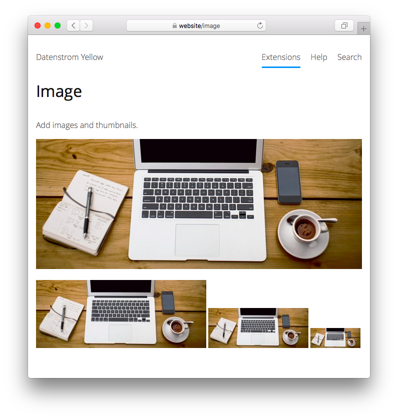

<a href="README-de.md">Deutsch</a> &nbsp; <a href="README.md">English</a> &nbsp; <a href="README-sv.md">Svenska</a>

# Image 0.8.19

Add images and thumbnails.

## How to install an extension

[Download ZIP file](https://github.com/annaesvensson/yellow-image/archive/refs/heads/main.zip) and copy it into your `system/extensions` folder. [Learn more about extensions](https://github.com/annaesvensson/yellow-update).

## How to add an image

Create an `[image]` shortcut.

The following arguments are available, all but the first argument are optional:
 
`Name` = file name  
`Alt` = description of the image, wrap multiple words into quotes  
`Style` = image style, e.g. `left`, `center`, `right`  
`Width` = image width, pixel or percent  
`Height` = image height, pixel or percent   

The image formats GIF, JPG, PNG and SVG are supported. All media files are located in the `media` folder. The `media/images` folder is the place to store your images. The `media/thumbnails` folder contains image thumbnails. You can also create additional folders and organise files as you like.

## Examples

Adding an image, different descriptions:

    [image photo.jpg Example]
    [image photo.jpg "This is an example image"]
    [image photo.jpg "This is an especially long description"]

Adding an image, different styles:

    [image photo.jpg Example left]
    [image photo.jpg Example center]
    [image photo.jpg Example right]

Adding an image, different sizes:

    [image photo.jpg Example right 50%]
    [image photo.jpg Example right 64 64]
    [image photo.jpg Example right 320 200]

Adding an image, different sizes with the default style:

    [image photo.jpg Example - 50%]
    [image photo.jpg Example - 64 64]
    [image photo.jpg Example - 320 200]

## Settings

The following settings can be configured in file `system/extensions/yellow-system.ini`:

`ImageUploadWidthMax` = maximum width for upload, larger images are resized  
`ImageUploadHeightMax` = maximum height for upload, larger images are resized  
`ImageUploadJpgQuality` = JPG quality for uploaded images  
`ImageThumbnailJpgQuality` = JPG quality for thumbnails  

## Acknowledgements

This extension includes a [photo](https://unsplash.com/photos/xII7efH1G6o) by Alejandro Escamilla. Thank you for the beautiful photo.

## Developer

Anna Svensson. [Get help](https://datenstrom.se/yellow/help/).
